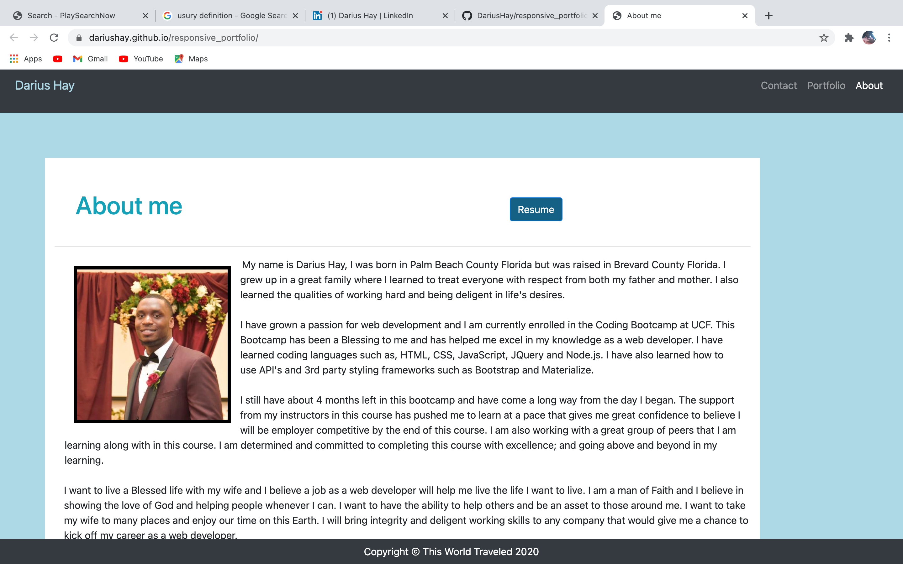
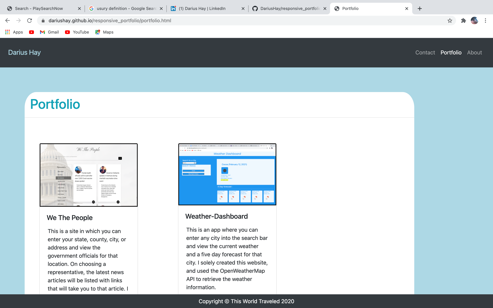
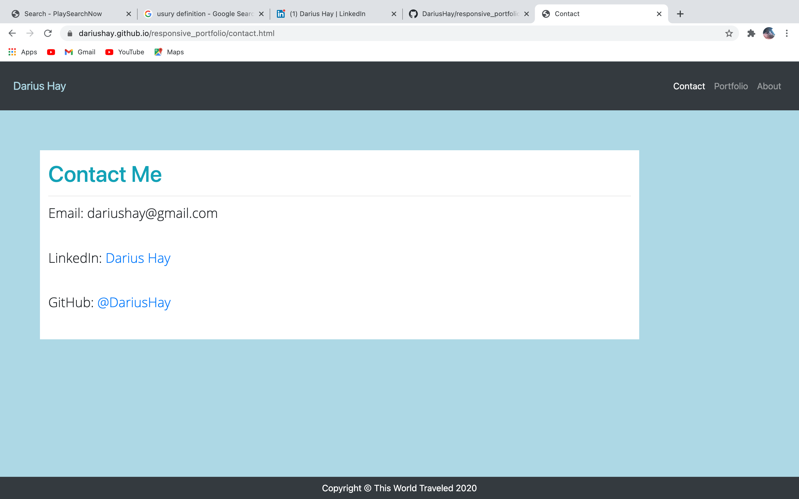

# responsive_portfolio
This is my web development portfolio website where I display some projects that I have created and attributed to. I have an about me page with a bit of background and a few of my goals and assets as a web developer. There is a porfolio page where some of my web development work is diplayed. I also have a contact page where I display my email address and have links to my linked in and github. 

# Screenshots 

# URL
https://dariushay.github.io/responsive_portfolio/
