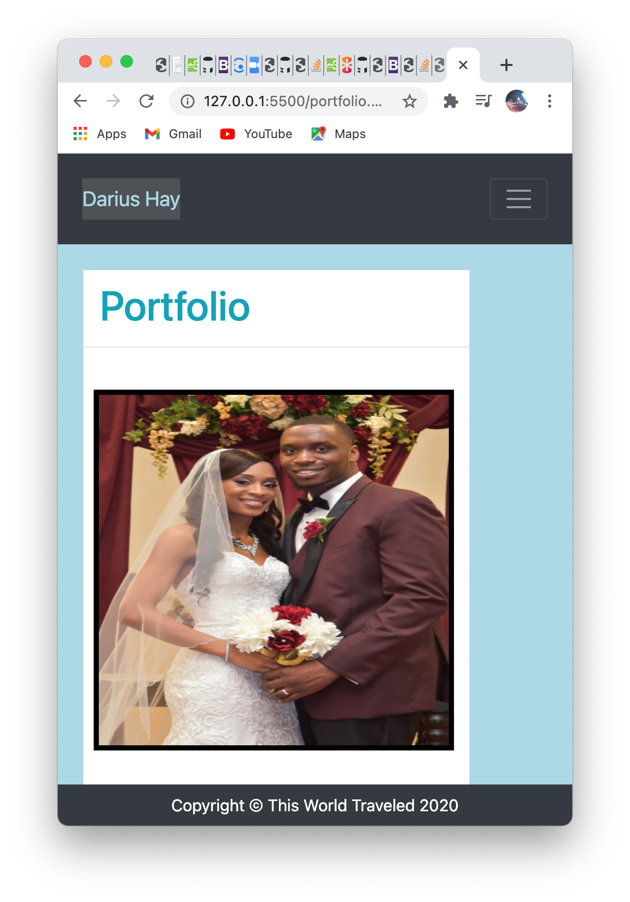

# responsive_portfolio
The purpose of this project is to create a responsive website that has an about me page, a portfolio page, and a contact page. As of now, I have pictures from my wedding 2 years ago in my portfolio page. The purpose of this page is to continue building upon it and adding more and more projects to my portofio as I creat them. I used Bootstrap and it's grid layouts to complete the styling of this website.
# Screenshots 

# URL
https://dariushay.github.io/responsive_portfolio/
